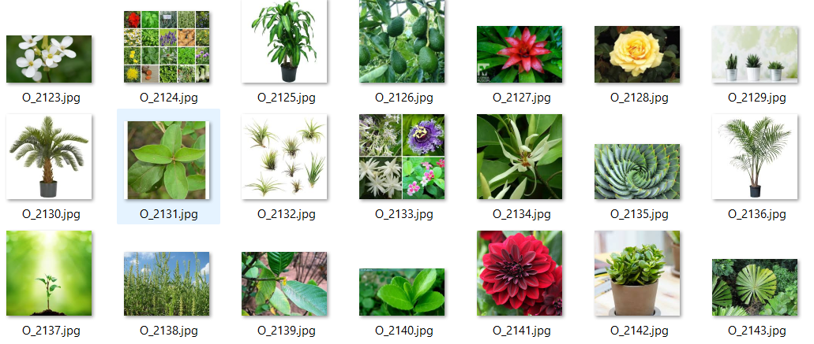
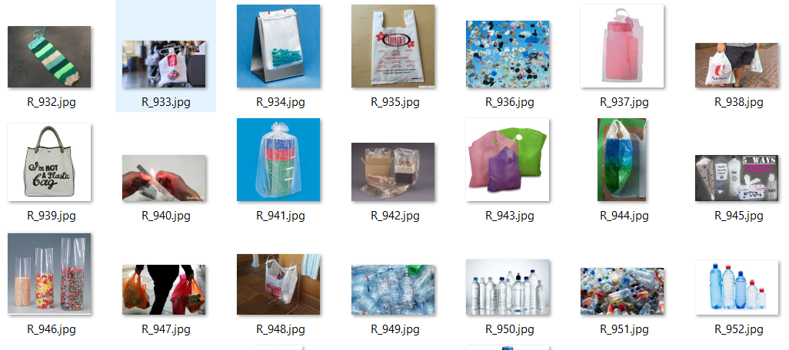

### Dataset

[Link tải](https://drive.google.com/file/d/1zw8vRs4Zju6cKPFCaCcq08ybqo-18bq7/view?usp=sharing)

**Mô tả:**

Dataset gồm 22500 ảnh về đồ vật / rác thải, trong đó có `55.69%` ảnh là vật hữu cơ, `44.31%` ảnh là vật vô cơ

Dataset được chia sẵn tập train / test với tỉ lệ `TEST / TRAIN = 1 / 9`

**Một số hình ảnh của tập dữ liệu:**

**Vật hữu cơ:**

**Vật vô cơ:**

